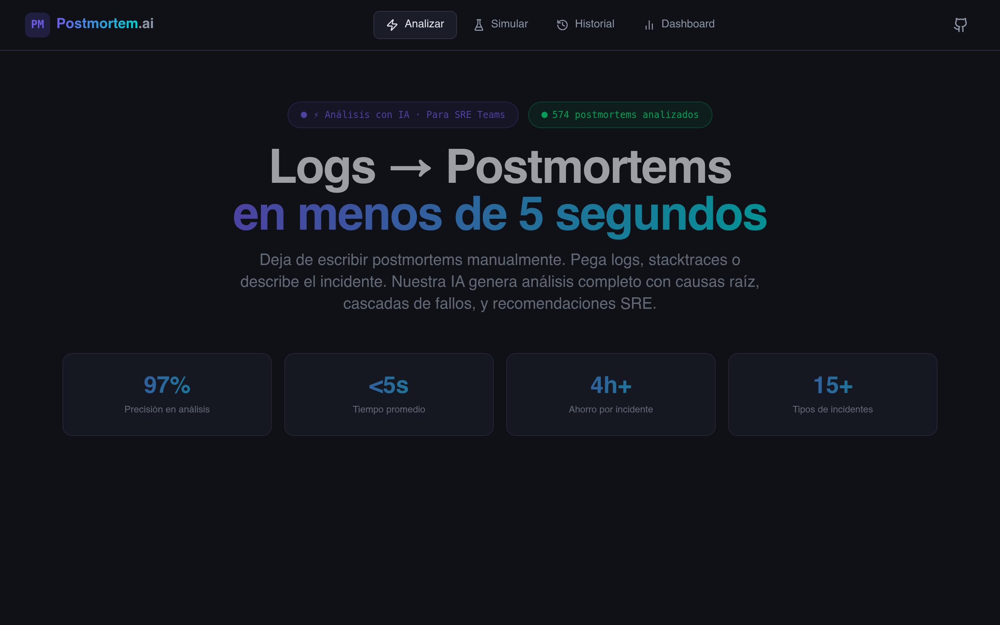
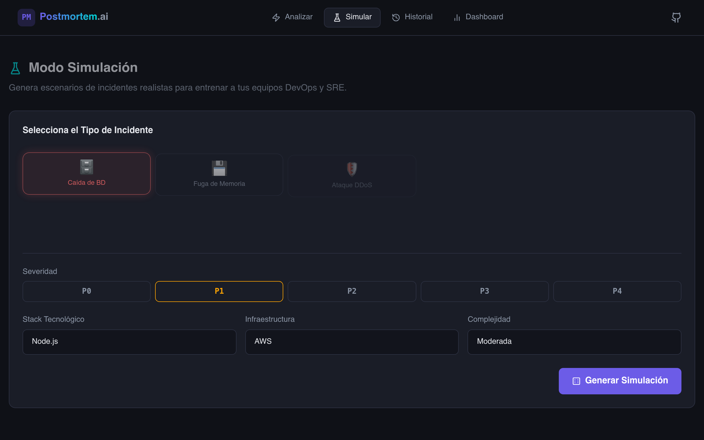
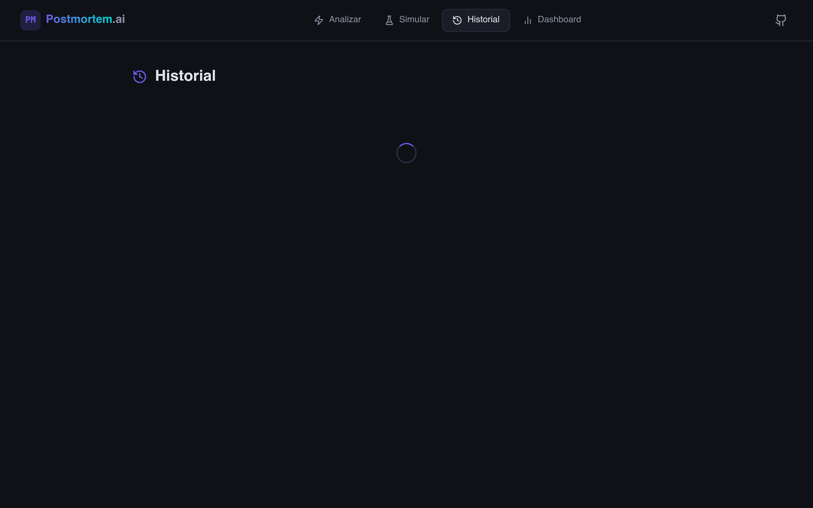
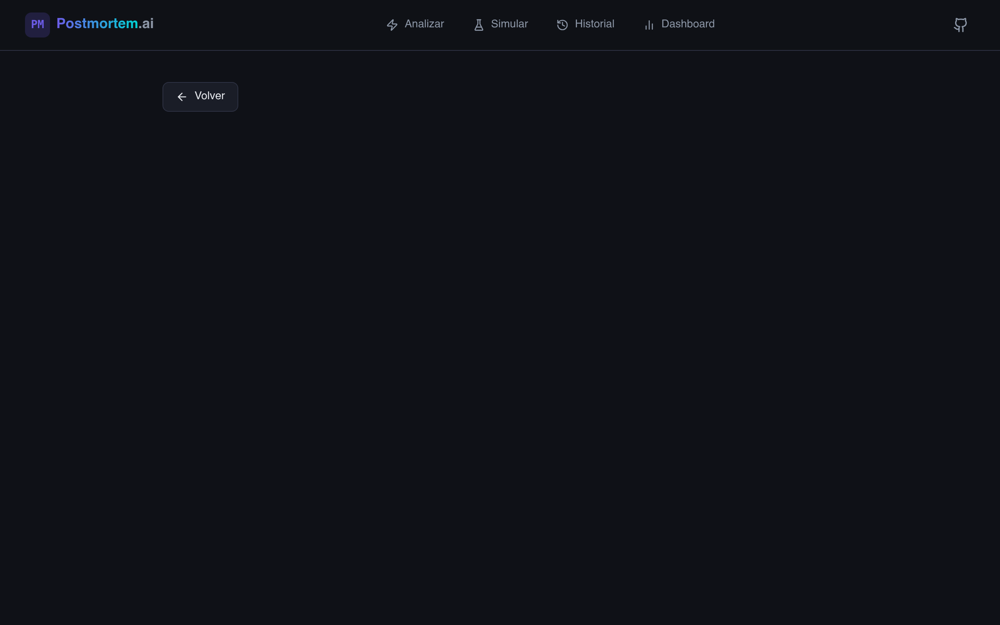

# 🔥 Postmortem.ai

> De logs caóticos a postmortems profesionales en segundos.

**Postmortem.ai** es una plataforma impulsada por IA que genera documentos de postmortem profesionales a partir de logs de servidor, stacktraces o descripciones de incidentes. Incluye un **Modo Simulación** para entrenar equipos DevOps y SRE con incidentes ficticios realistas.

🌐 **Demo:** [https://postmortem-ai.xyz](https://postmortem-ai.xyz)

---

## 📸 Capturas de Pantalla

### Página Principal — Análisis de Logs


### Modo Simulación — Genera Incidentes Realistas


### Historial — 574+ Postmortems Analizados


### Resultado de Análisis — Postmortem P1 Completo


---

## ✨ Funcionalidades

- 📋 **Análisis automático** — Pega logs o arrastra archivos, obtén un postmortem completo en segundos
- 🎲 **Modo Simulación** — Genera incidentes realistas para entrenar a tu equipo SRE
- 📅 **Timeline interactiva** — Línea de tiempo cronológica del incidente con severidad por evento
- 🔍 **Análisis de causa raíz** — Root Cause Analysis con detección de cascadas de fallos
- ✅ **Action Items** — Tareas post-incidente con prioridad y responsable sugerido
- 📄 **Exportación PDF y Markdown** — Postmortems profesionales listos para stakeholders
- 🧠 **Sistema multi-proveedor** — Groq (Llama 3.3) + Anthropic Claude como fallback
- ⚡ **Cache inteligente** — Similaridad semántica para evitar análisis redundantes
- 🌙 **Dark Mode** — Interfaz oscura temática DevOps
- 📱 **Responsive** — Funciona en móvil y escritorio

---

## 🛠️ Stack Tecnológico

| Capa | Tecnología |
|------|------------|
| Backend | Flask 3, Python 3.11 |
| Frontend | React 18, Vite, TailwindCSS, Framer Motion |
| IA Principal | Groq API + Llama 3.3 70B (análisis en <5s) |
| IA Fallback | Anthropic Claude (multi-provider resilience) |
| Cache | PostgreSQL (similitud semántica entre incidentes) |
| Infraestructura | CubePath VPS — gp.micro (Miami, USA) |
| Reverse Proxy | Nginx + SSL/TLS |
| Contenedores | Docker + Dokploy |

---

## ☁️ Desplegado en CubePath

Este proyecto fue desarrollado y desplegado íntegramente sobre la infraestructura de **CubePath** como parte de la Hackathon CubePath 2026.

### Especificaciones del VPS

| Recurso | Especificación |
|---------|---------------|
| Plan | **gp.micro** |
| vCPU | 2 vCPU |
| Memoria RAM | 4 GB |
| Almacenamiento | 80 GB SSD |
| Ancho de Banda | 5 TB / mes |
| Región | Miami, USA 🇺🇸 |
| Hostname | `vps22365.cubepath.net` |
| Costo | ~$9.51/mo (dentro del crédito de la hackathon) |

### Por qué CubePath

- 🚀 **Setup en minutos** — VPS listo en segundos, sin configuración compleja
- 🐳 **Dokploy integrado** — Deploy de contenedores Docker directamente desde el panel
- 🔒 **SSL automático** — Certbot + Nginx configurado sin fricciones
- 📊 **Métricas en tiempo real** — Monitoreo de CPU, RAM y red desde el dashboard
- 💰 **Precio accesible** — $9.51/mes para una app full-stack con backend + frontend + PostgreSQL
- 🌎 **Baja latencia** — Nodo en Miami ideal para usuarios de Latinoamérica

### Arquitectura en CubePath

```
Internet → Nginx (SSL) → Docker
                           ├── Frontend (React/Vite) :80
                           ├── Backend (Flask/Gunicorn) :5000
                           └── PostgreSQL :5432
```

---

## 🚀 Desarrollo Local

### Backend

```bash
cd backend
python3 -m venv venv
source venv/bin/activate       # Windows: venv\Scripts\activate
pip install -r requirements.txt
cp .env.example .env           # Agregar GROQ_API_KEY y/o ANTHROPIC_API_KEY
flask run
```

### Frontend

```bash
cd frontend
npm install
npm run dev
```

Abrir [http://localhost:5173](http://localhost:5173)

---

## 📡 Endpoints de la API

| Método | Endpoint | Descripción |
|--------|----------|-------------|
| POST | `/api/analyze` | Analiza logs → genera postmortem |
| POST | `/api/simulate` | Genera incidente simulado con IA |
| GET | `/api/postmortems` | Lista el historial |
| GET | `/api/postmortems/:id` | Obtiene un postmortem específico |
| DELETE | `/api/postmortems/:id` | Elimina un postmortem |
| POST | `/api/export/markdown` | Exporta a Markdown |
| POST | `/api/export/pdf` | Exporta a PDF |
| GET | `/api/stats` | Estadísticas globales |
| GET | `/api/health` | Health check |

---

## 📦 Deploy en CubePath

```bash
# En tu VPS de CubePath:
bash deploy/setup.sh
# Editar /opt/postmortem-ai/backend/.env con tu API key
# SSL automático: certbot --nginx -d tu-dominio.cubepath.app
```

---

## 🏆 Hackathon CubePath 2026

Creado para la **Hackathon CubePath 2026** organizada por [midudev](https://github.com/midudev) x CubePath.

- ✅ Desplegado en VPS CubePath (plan gp.micro, Miami)
- ✅ Proyecto nuevo, sin usuarios previos
- ✅ Repositorio público con demo funcional
- ✅ Crédito de $15 utilizado para el VPS

---

## 👨‍💻 Autor

**© 2026 Postmortem.ai**
Engineered by Luis Merino • Inspirado en Google SRE Book
