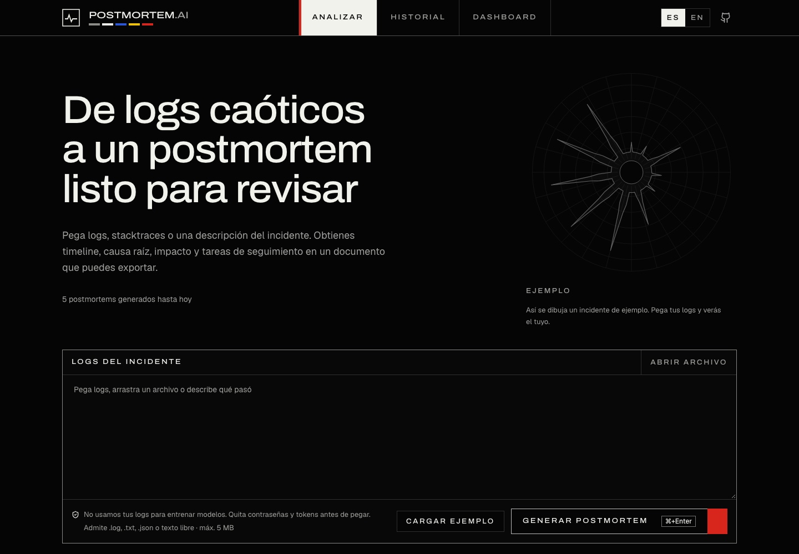
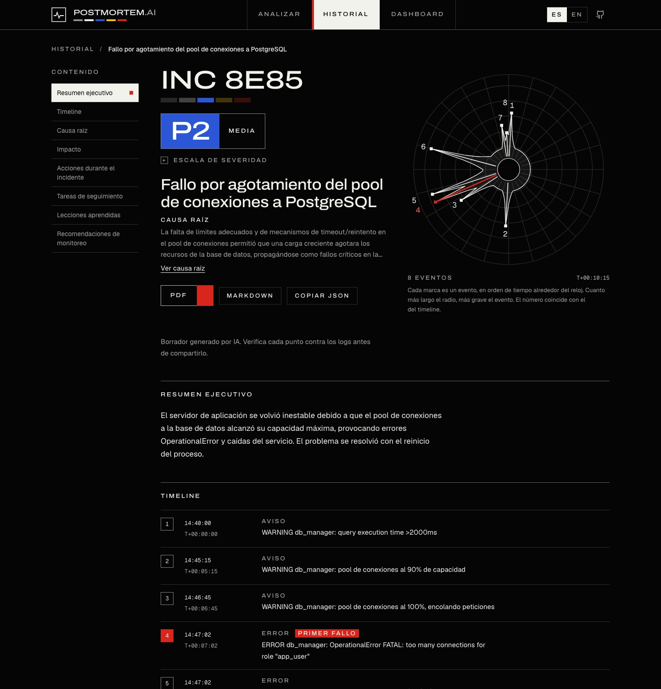
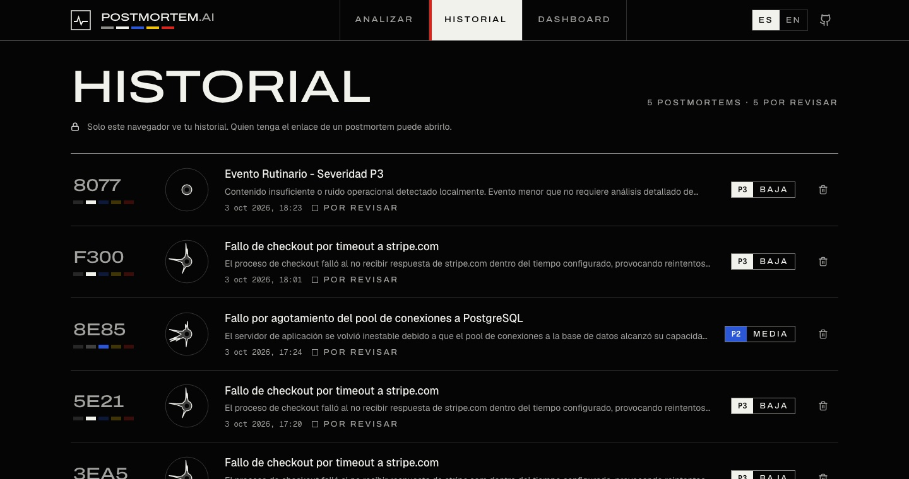

# Postmortem.ai


[](https://github.com/LMerikov/postmortem-ai/actions/workflows/ci.yml)

> De logs caóticos a un postmortem listo para revisar.

Postmortem.ai convierte logs, stacktraces o una descripción del incidente en un postmortem estructurado: timeline, causa raíz, impacto, tareas de seguimiento y recomendaciones de monitoreo. El resultado se exporta en PDF o Markdown.

Español e inglés · Sin registro · Se ejecuta en local (ver [Inicio rápido](#inicio-rápido))

*English summary: paste logs or a stack trace, get a structured incident postmortem (timeline, root cause, impact, follow-ups) you can export as PDF or Markdown. The UI is available in Spanish and English.*

## Por qué existe

Después de un incidente, el equipo tiene logs, mensajes de chat y memoria. Escribir el postmortem lleva horas y suele quedarse a medias, justo cuando más importa aprender. Postmortem.ai hace el primer borrador para que el equipo dedique su tiempo a revisarlo y decidir, no a transcribir.

El modelo propone; el equipo valida. El documento separa el disparador inicial de los síntomas que provocó, para que la discusión empiece por la causa y no por el ruido.

## Recorrido

1. Pega logs, arrastra un archivo `.log`, `.txt` o `.json`, o describe lo que pasó.
2. Pulsa **Generar postmortem** o `Ctrl/⌘ + Enter`.
3. El servidor filtra ruido, busca un análisis similar previo de tu navegador y, si no lo hay, consulta al modelo.
4. Revisa el resultado: la cabecera muestra la severidad y la causa raíz; debajo van resumen, timeline, causa raíz (con la conclusión primero y la evidencia línea a línea), impacto y tareas. Lecciones, monitoreo y acciones tomadas vienen plegadas. En móvil, un selector salta entre secciones.
5. Es un borrador del modelo: verifica cada punto contra los logs, marca las tareas y pulsa **Marcar como revisado**. Esas marcas se guardan solo en tu navegador.
6. Exporta a PDF o Markdown, o copia el JSON a tu herramienta de tickets.
7. Vuelve a él desde **Historial**, que solo muestra lo que generaste en este navegador e indica cuáles faltan por revisar.







## Inicio rápido

### Requisitos

- Python 3.11 o posterior y Node.js 20 o posterior.
- Una clave de [Groq](https://console.groq.com) o de [Anthropic](https://console.anthropic.com). Con las dos, Claude actúa como respaldo de Groq.

### Backend

```bash
cd backend
python3 -m venv venv
source venv/bin/activate        # Windows: venv\Scripts\activate
pip install -r requirements-dev.txt
cp .env.example .env            # Agrega GROQ_API_KEY y/o ANTHROPIC_API_KEY
python app.py                   # http://127.0.0.1:5000
```

En macOS el puerto 5000 lo ocupa el Receptor AirPlay. Usa otro puerto en el backend y apunta el frontend a él:

```bash
PORT=5050 python app.py
VITE_API_TARGET=http://127.0.0.1:5050 npm run dev   # en frontend/
```

### Frontend

```bash
cd frontend
npm install
npm run dev                     # http://localhost:5173
```

Usa **Cargar ejemplo** para probar con un incidente de pagos ficticio, o **Abrir archivo** con los de [examples/logs](examples/logs) (cuatro incidentes ficticios, de P1 a una caída total P0, con su causa raíz esperada).

## Cómo usa la IA

- **Groq con GPT-OSS 120B** (`openai/gpt-oss-120b`) es el proveedor principal: rápido, con JSON fiable y razonamiento en esfuerzo bajo. Se cambia con `GROQ_MODEL`.
- **Plan gratuito de Groq.** El límite es de 8.000 tokens por minuto (`GROQ_TPM_LIMIT`): el servidor recorta la entrada para caber, cae a `openai/gpt-oss-20b` (`GROQ_FALLBACK_MODEL`) si el principal se satura y, si aun así hay límite, responde 429 con el tiempo de espera y la interfaz reintenta sola.
- **Anthropic Claude** entra como respaldo si Groq falla o no está configurado.
- Antes de llamar al modelo, un **filtro local** quita líneas `INFO`/`DEBUG`, hashes, UUIDs y direcciones de memoria. Si no queda señal de incidente, responde sin gastar una llamada.
- Una **caché por similitud** reutiliza un análisis previo cuando los logs son casi iguales, solo dentro del mismo navegador.

La respuesta del modelo debe ser JSON con un esquema fijo. Si no lo es, el análisis falla con un error visible; la interfaz nunca rellena huecos con contenido inventado.

## Arquitectura

| Capa | Tecnología |
|------|------------|
| Interfaz | React 18, Vite, Tailwind CSS, i18next, Framer Motion |
| API | Flask 3, Gunicorn, Flask-Limiter |
| IA | Groq (GPT-OSS 120B) y Anthropic Claude |
| Datos | PostgreSQL en producción, SQLite en local |
| Exportación | ReportLab (PDF) y Markdown |
| Despliegue | Docker, Nginx y PostgreSQL (ver [Despliegue](#despliegue)) |

Flujo, límites de confianza y decisiones en [docs/ARQUITECTURA.md](docs/ARQUITECTURA.md).

## Privacidad y seguridad

- **Historial privado por navegador.** Cada navegador tiene un identificador anónimo; el servidor guarda solo su hash. Nadie ve ni borra los postmortems de otra persona, y la caché no mezcla resultados entre navegadores.
- **Enlaces compartibles.** Quien tenga el enlace de un postmortem puede abrirlo, como en un documento compartido.
- **La revisión es local.** Las tareas marcadas y el estado "revisado" viven en el `localStorage` de cada navegador (solo identificadores y marcas, nunca el contenido). No se comparten con quien abra el enlace ni aparecen en las exportaciones.
- **Tus logs salen hacia Groq o Anthropic** para generar el análisis. Quita contraseñas, tokens y datos personales antes de pegar.
- Las claves de API viven solo en `backend/.env`, que Git ignora.
- CSP estricta, sin cookies, límite de peticiones por IP y fuentes servidas desde el propio dominio.

## API

| Método | Ruta | Descripción |
|--------|------|-------------|
| POST | `/api/analyze` | Analiza logs y devuelve `{ id, postmortem }` |
| GET | `/api/postmortems` | Historial del navegador (`X-Client-Id`) |
| GET | `/api/postmortems/:id` | Un postmortem por enlace |
| DELETE | `/api/postmortems/:id` | Borra si pertenece al navegador |
| POST | `/api/export/markdown` | Exporta a Markdown |
| POST | `/api/export/pdf` | Exporta a PDF |
| GET | `/api/dashboard` | Resumen del navegador (`X-Client-Id`): totales, severidades y tipos de error |
| GET | `/api/stats` | Contador global de postmortems generados, sin contenido |
| GET | `/api/health` | Estado del servicio |

## Verificación

```bash
cd frontend && npm run check          # ESLint + build de producción
cd backend && python -m pytest tests  # Aislamiento entre navegadores y migración
python scripts/e2e.py                 # Punta a punta con un modelo real (ver cabecera del script)
```

GitHub Actions ejecuta los dos primeros en cada push y pull request, con dependencias del backend fijadas por hash (`requirements-dev.lock`).

## Despliegue

El proyecto se desarrolló para la Hackathon CubePath 2026 de [midudev](https://github.com/midudev) × CubePath y estuvo desplegado en un VPS con Docker, Nginx y PostgreSQL. Hoy vive solo en este repositorio; `deploy/setup.sh` documenta cómo levantarlo en un VPS propio.

```
Internet → Nginx (TLS) → Docker
                          ├── Flask + Gunicorn (sirve también el build del frontend)
                          └── PostgreSQL
```

Configura `backend/.env` con tus claves (ver `backend/.env.example`). La tabla de postmortems y la caché se migran solas al arrancar (columna `owner_hash`).

## Diseño y producto

- [PRODUCT.md](PRODUCT.md): para quién es, principios y restricciones.
- [DESIGN.md](DESIGN.md): el sistema visual "Catálogo numerado" (negro mate, bloques de severidad, traza polar calculada con los datos del incidente).
- [docs/UX_AUDIT.md](docs/UX_AUDIT.md): auditoría de usabilidad y su seguimiento.

## Autor

Hecho por **Luis Merino**. Formato inspirado en el [Google SRE Book](https://sre.google/sre-book/postmortem-culture/).
